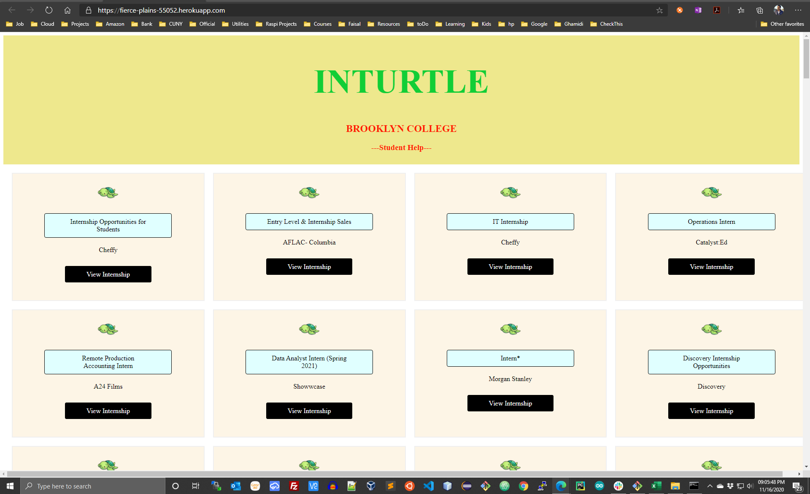
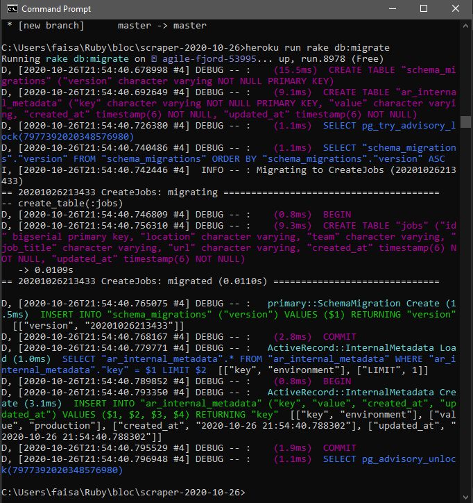

# Internship-Project-4900

 
## Purpose:

1. Help students search internships.
2. Help bloc by providing our data.
3. Help in project 4900
4. Help Brooklyn College Students
5. Help community with a free resourse.
6. Help Development of code.

## Objective:

1. Low-cost, self-maintained data scraping App.
2. Which can do data acces from internet.
3. Do data manipulation
4. Create your own API
4. Host a web app/site to present that data.

## Project Structure:

1. **BACKEND** 
   - Data Source
     - Online sites with data
     - Look for useful info
     - Seach for tools of retrievel
   - Retrievel
     - Useful information
     - Retrievel tools
     - Parse data
     - Look for useful informnation
     - Match with our needs
   - Scraper
     - Create your own web scraper app
     - Make it compatible with database
     - Coding involved with db connection
     -                                           
   - Database
     - Database setup
     - Creation of tables and columns
     - AUTO UPDATE
   - ACCOUNT SETUP
     - DOMAIN NAME CREATION
     - API FOR HOSTING SITE ON DNS
     - AUTO UPDATE IP ADDRESS 
     
     
     
2. **WEB ACCESS / DATA RETRIEVEL**
   - API
     - GOOGLE MAPS
       - ACCOUNT
       - API KEY SETUP
       - .
         
   - DATA RETRIEVEL
     - THE NEW YORK TIMES (git repo)
       - https://github.com/nytimes/covid-19-data
     - GIT
       - CLONE
       - AUTO UPDATE
       - CRON JOBS
       
3. **DATA MANIPULATION**
   - SHELL SCRIPTS
     - CONVERT DOWNLOADED DATA
     - SPLIT DATA
       - ACCORDING TO THE STATES
       - ACCORDING TO THE COUNTIES
     - STORE AT SERVER
       - DATA INTEGRITY IN MIND
     - SYNC WITH WEB SERVER
       - SECURE DATA TRANSFER
          

4. **WEB APP/SITE (front-end)**
   - SOFTWARE
     - HTML
     - CSS
     - JAVASCRIPT
   - DOMAIN NAME
     - www.HeemsResources.com

5. **USAGE**
   - GO TO: www.HeemsResources.com
   - GOOGLE MAPS IS INTEGRATED
   - FOR STATE COVID-19 DATA CLICK ON THE NAME
   - CLICK ON 'LOAD DATA'
   - WEB SCREEONSHOTS
    
   
   
   
